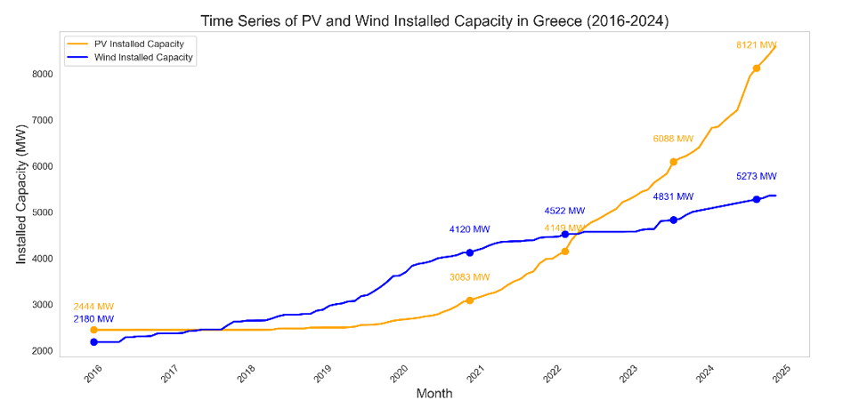
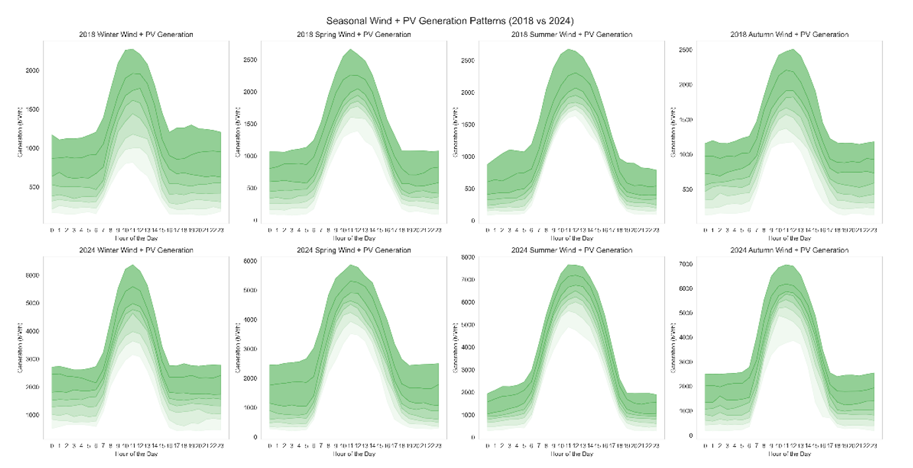
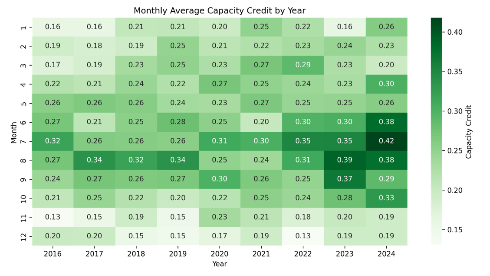
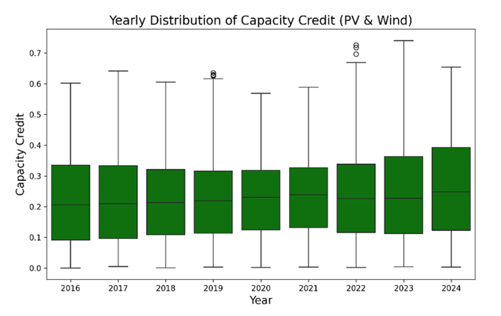

# Estimating the Capacity Credit of Wind & PV Parks: Greek Market (2016-2024)

**📢 Conference Presentation:** Accepted and presented at **ECESCON 15** (Electrical and Computer Engineering Students' Conference, 2025).

### 📖 Overview
This repository presents a comprehensive capacity adequacy analysis of the Greek interconnected electricity system, evaluating the combined Capacity Credit of Wind and Solar (PV) generation over a 9-year period (2016-2024). 

As Variable Renewable Energy (VRE) sources dominate the generation mix (exceeding 60% in 2024), understanding their real contribution to covering peak load demand is critical for grid stability, portfolio risk management, and strategic BESS (Battery Energy Storage Systems) deployment.

### ⚙️ Methodology & Data Engineering
The study processes extensive hourly time-series data from ENTSO-E and IPTO. 
* **Data Processing:** Python was utilized for automated data cleaning, missing value interpolation, and statistical percentile analysis across 78,879 hours.
* **Algorithm:** An Approximation-based method (Capacity Factor-based approximation) was implemented. 
* **Focus Area:** The model evaluates periods of high grid stress by averaging the capacity factor over the top 30% of the hourly peak load periods for each year.

The capacity factor for the selected peak periods is calculated as:
`CF = E / (Po * Δt)`
*(Where E is the generated energy, Po the installed capacity, and Δt the time period)*.

### 📊 Key Findings & VRE Synergy
The analysis revealed a strong complementary relationship between Solar and Wind generation, balancing fluctuations in energy production across the year.

* **Seasonal Complementarity:** PV production peaks during the summer, effectively covering the period when wind potential is at its lowest. Conversely, wind generation strengthens during winter months, offsetting lower solar irradiance.
* **Monthly Capacity Credit:** The combined capacity credit reaches its maximum during summer (e.g., July peaks up to 0.42) driven by high solar output, while winter months show constrained reliability (0.13 - 0.20).
* **Output Probability:** The likelihood of combined PV and Wind generation exceeding 60% of their total nominal capacity is strictly limited (less than 0.05% of the time). For approximately 58% of the analyzed period, generation was below 20% of the installed capacity.

### 💶 Commercial Impact & The Need for Energy Storage
The long-term assessment shows an upward trend in the median capacity credit (moving from ~0.2 in 2016 to ~0.5 in 2024), yet marked by significant year-to-year volatility due to meteorological dependencies. 

**System Replacement Value:** Based on 2024 metrics, for every 100 MW of combined PV and Wind capacity added to the grid, approximately **22 MW** of conventional thermal generation can be safely replaced without jeopardizing system adequacy.

**Conclusion:** While the integration of PV and Wind demonstrates excellent seasonal synergy, the inherently low combined capacity utilization underscores the absolute necessity of integrating large-scale **Battery Energy Storage Systems (BESS)** to capture excess generation and provide firm, dispatchable power during critical load hours.
